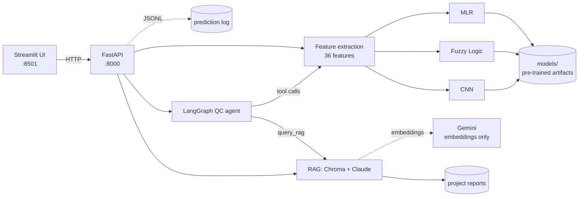

# ⚙️ Surface Roughness Predictor

**Predict machined-part surface roughness (Ra, µm) from raw 3-axis vibration signals — three competing models, one API, one command to run.**

[](https://github.com/USERNAME/surface-roughness-predictor/actions/workflows/ci.yml)


> 🔗 **[Live demo](https://huggingface.co/spaces/USERNAME/surface-roughness-predictor)** · **[API docs](https://huggingface.co/spaces/USERNAME/surface-roughness-predictor)** (Swagger UI at `/docs`)

In CNC machining, surface roughness is normally measured *after* the fact with a contact profilometer — the part has to come off the machine. This project estimates it **in-process** from accelerometer data, so a bad surface can be caught while the part is still in the fixture.

---

## What it does

Upload a vibration capture (`.csv` / `.xlsx` with `Channel1 [g]`, `Channel2 [g]`, `Channel3 [g]`) and the service:

1. Extracts **36 features** per part — time domain (RMS, peak, crest factor, kurtosis), frequency domain (PSD, dominant frequency, total energy, spectral entropy), and STFT domain (centroid, bandwidth, entropy, kurtosis) across all three axes.
2. Runs **three independent models** over those features.
3. Returns each prediction, the spread between them, and a surface quality band.

Running three models side by side is the point: they disagree, and the spread is a useful confidence signal. On top of that, an **LLM agent** can run a full QC assessment that decides for itself which models to trust and when to check the project's own documentation — see [Agentic QC pipeline](#agentic-qc-pipeline) below.

## Model comparison

Trained on 27 machined parts with profilometer ground truth.

| Model | Accuracy | R² | Features | Architecture |
|---|---:|---:|---:|---|
| **CNN** | **96.77%** | **0.895** | 36 | `Conv1D(32) → Dropout(0.2) → Dense(16) → Dense(1)`, 300 epochs |
| **MLR** | 92.25% | 0.464 | 4 | Best 4-feature combination, exhaustively searched from 12 group representatives |
| **Fuzzy Logic** | 90.25% | 0.176 | 4 | 81-rule Mamdani system, centroid defuzzification |

*These are training-set fits on a 27-part dataset, not held-out scores — the dataset is too small to hold out meaningfully. The CNN's R² advantage partly reflects its much larger capacity over 36 inputs.*

## Agentic QC pipeline

`POST /agent/predict` runs a second, fundamentally different way of getting from vibration data to a QC decision: a [LangGraph](https://github.com/langchain-ai/langgraph) tool-calling agent (`agent/qc_agent.py`), not a fixed if/else pipeline. Given one part's 36 features, the agent (Claude Sonnet 5, via `langchain-anthropic`) decides for itself — call by call — which of six tools to use and in what order:

- **`get_signal_noise_level`** — assess crest factor / kurtosis first, to judge how much to trust any single prediction.
- **`predict_mlr` / `predict_fuzzy` / `predict_cnn`** — call one, two, or all three models, in whatever order the noise level and its own judgment suggest.
- **`check_training_range`** — the extrapolation guard: every model was fit on 27 parts with ground-truth Ra between 1.931 and 2.812 µm, so a prediction outside that band is an extrapolation, not an interpolation, regardless of the model's training-set R². The agent is instructed to flag and downweight an out-of-range prediction rather than trust it just because it came from the highest-R² model — especially when the *other* models agree with each other and land inside the known range.
- **`query_rag`** — when predictions are borderline (near the 2.3 µm smooth/average boundary) or the models disagree by more than ~0.2 µm, the agent consults the project's own documentation before finalizing its answer (see below), rather than resolving the disagreement by guessing.

It ends with a plain-text QC report and a `Final Ra Estimate: X.XXXX µm` line. The API returns the full tool-by-tool trace (`tool_calls`, each with its input, output, and the agent's reasoning at that point) alongside the parsed `ra`, so the reasoning path is inspectable, not just the final number — the Streamlit UI's **Agentic QC Pipeline** tab renders this trace directly.

**RAG-grounded documentation Q&A.** `query_rag` (and the standalone `POST /rag/ask` endpoint, surfaced in the UI's **Ask About This Project** tab) answers questions using only the project's own reports — retrieval against a Chroma vector store of the Capstone reports and metrics-clarification doc, then a Claude call constrained to those excerpts. A cosine-distance threshold (0.35) decides whether the retrieved chunks are actually relevant; below it, the question is answered from the excerpts, above it the response is a "not grounded" fallback rather than an answer made up from the model's general knowledge (see the threshold-selection reasoning in `rag/qa_engine.py`'s module docstring).

**Two different LLM providers, split by role.** Claude Sonnet 5 (via `langchain-anthropic`) does all of the reasoning: the agent's tool-calling loop in `agent/qc_agent.py` and the answer-generation call in `rag/qa_engine.py`. Gemini (`gemini-embedding-001`, via `langchain-google-genai`) does none of the reasoning — it's used exclusively in `rag/vector_store.py` to embed the document chunks and the incoming question into vectors for the Chroma similarity search. Retrieval (Gemini embeddings) and generation (Claude) are two separate steps in the RAG pipeline, each using the model best suited to it; the split is deliberate, not incidental.

**How determinism actually works now.** Claude Sonnet 5 has no `temperature` parameter at all — sending one returns a 400 (`temperature is deprecated for this model`), so unlike the project's original Gemma-based agent, there's no sampling knob to pin to 0. The three prediction models' own numeric outputs are still exactly reproducible (they're plain deterministic ML inference, untouched by the LLM), but early testing showed the *agent's final synthesis* — specifically, whether it excluded/downweighted a diverging model or fell back to an equal three-way average — could vary between runs on identical input (e.g. 2.3776 µm vs. 2.4516 µm for the same part). Rather than relying on a sampling parameter that no longer exists, the system prompt (`agent/qc_agent.py`) now states an explicit, three-step tie-breaking rule for the final estimate: (1) exclude any model flagged by `check_training_range` as an extrapolation risk and average the rest; (2) if all three are in-range but one diverges from the other two by more than 0.15 µm, weight toward the average of the two closer models instead of an outlier-including three-way average; (3) only average all three equally when none qualifies as an outlier under (1) or (2). This was verified with 5 back-to-back runs on the same part (part 28) after adding the rule — all 5 produced the identical `Final Ra Estimate: 2.3776 µm`, with the report explicitly citing the rule each time. The LLM's free-text reasoning and report wording can still vary slightly run to run — a hosted API isn't guaranteed bit-for-bit deterministic even with an explicit rule — but the numeric outcome the rule governs is now stable in practice.

**Historical issue: LLM latency and occasional hangs (resolved by the Claude switch, machinery kept as a safety net).** During development, the agent ran on Gemini's free tier (16,000 input tokens/minute), so a multi-tool-call run routinely got rate-limited and had to back off — a full run could take anywhere from ~30 seconds to several minutes, and consecutive timeouts on the same part weren't unusual. Separately, the underlying LLM call was occasionally observed to hang well past its own configured timeout (a slow trickle of bytes on the response can outlast a per-read `httpx` timeout without ever triggering it). This motivated `/agent/predict` running the whole agent under a **hard 90-second wall-clock deadline**, independent of and on top of the per-call timeout, on its own thread pool; if the deadline fires, the API returns a clean `504` rather than hanging the request, and writes a diagnostic dump (the last tool call completed, plus a full stack trace of the stuck thread) to `logs/agent_hang_*.log`. Python has no safe way to kill a running thread, so a timed-out run keeps executing in the background rather than being cancelled — harmless, but it did mean a burst of back-to-back timeouts could compound the same rate limit for a little while afterward. **Since switching to Claude, this has not recurred**: repeated real `/agent/predict` runs (single runs and back-to-back batches of 3-5) have logged zero rate-limit retries, and typical run time is a fairly consistent ~50-90 seconds. The deadline/hang-detection/logging machinery stays in place regardless — it's a general safety net against any LLM provider stalling mid-response, not a Gemini-specific workaround, so there's no reason to remove it.

## Architecture



The UI holds no business logic — it renders whatever the API returns. That split means the inference service can be called programmatically, scaled, or swapped behind a different front end without touching the models.

## Quickstart

First, create a `.env` file in the project root with both API keys — the agent and RAG generation need `ANTHROPIC_API_KEY`, the RAG embeddings need `GOOGLE_API_KEY`; `docker compose` reads this file directly (`env_file: .env` on the `api` service), and the container won't start cleanly without it:

```bash
GOOGLE_API_KEY=AIza...
ANTHROPIC_API_KEY=sk-ant-...
```

Then:

```bash
docker compose up
```

That's the whole setup. UI at <http://localhost:8501>, Swagger at <http://localhost:8000/docs>. A sample input is included at `data/sample/part_28.xlsx` — upload it in the dashboard to try all three tabs. Models ship pre-trained in `models/`, so there's no training step. On first startup the API container also builds the RAG index from `docs/` into a persistent `chroma_db` volume — a few extra seconds once, not on every restart.

<details>
<summary>Running without Docker</summary>

```bash
pip install -r requirements-dev.txt -r requirements-agent.txt
uvicorn api.main:app --port 8000    # terminal 1
streamlit run app.py                # terminal 2
```
</details>

## API

| Endpoint | Purpose |
|---|---|
| `POST /predict` | Upload a vibration file → predictions from all three models |
| `POST /predict/features` | Predict from the 36 features directly (programmatic callers) |
| `POST /agent/predict` | Upload a vibration file → the LangGraph QC agent's full tool trace, report, and final Ra (see [Agentic QC pipeline](#agentic-qc-pipeline)); bounded by a 90s deadline, returns `504` on timeout |
| `POST /rag/ask` | Ask a question about the project's own documentation, RAG-grounded |
| `GET /models/status` | Which models are loaded and ready |
| `GET /health` | Liveness probe |
| `GET /docs` | Interactive Swagger UI |

```bash
curl -F "file=@part.csv" http://localhost:8000/predict
```

```json
{
  "filename": "part.csv",
  "channels_found": ["Channel1 [g]", "Channel2 [g]", "Channel3 [g]"],
  "predictions": [
    { "model": "MLR", "ra": 2.2472, "available": true, "detail": null },
    { "model": "Fuzzy Logic", "ra": 2.0627, "available": true, "detail": null },
    { "model": "CNN", "ra": 2.2242, "available": true, "detail": null }
  ],
  "spread_um": 0.1846,
  "category": "Smooth",
  "latency_ms": 173.9
}
```

*(Actual response for a held-out part, served from the container — the three models land within 0.18 µm of each other.)*

## Tests

```bash
pytest
```

33 tests, 91% coverage. Feature extraction is verified against **analytically known values** — a 2.0-amplitude sine wave must produce RMS = 2/√2 and crest factor = √2, and a 1 kHz tone must be recovered as the dominant frequency — rather than against golden outputs that would just re-encode whatever the code currently does.

## Retraining

Training is a deliberate offline step, not part of the service:

```bash
python save_models.py
```

Requires `parts.zip` (~110 MB of raw captures, not in the repo). Writes all model artifacts plus `models/metrics.json`, which is what populates the comparison table above.

## Engineering notes

**Why the API/UI split?** The original prototype was one Streamlit file importing the models directly — every viewer loaded TensorFlow into the same process. Splitting them means the UI container ships without TensorFlow at all, and the models become reachable by anything that speaks HTTP.

**Why ship pre-trained models in git?** The artifacts total ~250 KB. Committing them makes `docker compose up` work from a clean clone with no training step and no model-registry dependency. The 110 MB of raw training data stays out of the repo.

**Why pinned scikit-learn and TensorFlow?** The `.pkl` estimators and the `.keras` artifact are sensitive to major-version drift. CI builds the image and asserts `/models/status` reports all three models loaded, so a dependency bump that silently breaks unpickling fails the build rather than production.

**What's deliberately not here:** no auth, no database, no model registry, no Kubernetes, no metrics backend. This is a single-user demo service with a fixed model set — each of those would add real operational surface for no benefit at this scope. The retraining pipeline stays a manual script because the dataset is fixed at 27 parts.

**Known limitation:** with 27 training samples and no held-out set, the reported scores are optimistic. Reliable generalization claims would need substantially more parts and a proper train/test split.

**Historical limitation — LLM latency and timeouts (resolved by the Claude switch):** see [Agentic QC pipeline](#agentic-qc-pipeline) above. `/agent/predict` used to be the slowest and least predictable endpoint in this service by a wide margin, driven by Gemini's free-tier quota and occasional post-response hangs; it's still bounded by a hard 90s deadline so it fails cleanly rather than hanging, but that deadline has not actually fired under real Claude usage — typical runs land around 50-90 seconds with no rate-limit retries.

## Project layout

```
api/        FastAPI service — routes, schemas, prediction orchestration
agent/      LangGraph tool-calling QC agent + its tool definitions
rag/        Document loading, Chroma vector store, RAG Q&A engine
modules/    Feature extraction, the three models, config, typed errors
models/     Pre-trained artifacts + metrics.json
logs/       Prediction log + agent hang diagnostics (gitignored)
tests/      pytest suite
legacy/     Original academic notebooks and stage scripts
app.py      Streamlit UI (API client only) — Predictions / Agentic QC Pipeline / Ask About This Project tabs
save_models.py   Offline training entry point
```

## License

MIT
