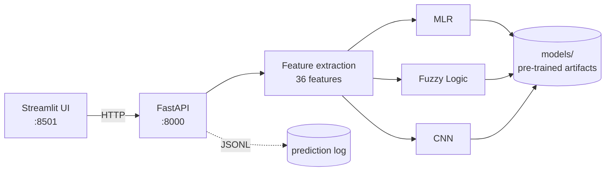

# ⚙️ Surface Roughness Predictor

**Predict machined-part surface roughness (Ra, µm) from raw 3-axis vibration signals — three competing models, one API, one command to run.**

[](https://github.com/USERNAME/surface-roughness-predictor/actions/workflows/ci.yml)


> 🔗 **[Live demo](https://huggingface.co/spaces/USERNAME/surface-roughness-predictor)** · **[API docs](https://huggingface.co/spaces/USERNAME/surface-roughness-predictor)** (Swagger UI at `/docs`)

In CNC machining, surface roughness is normally measured *after* the fact with a contact profilometer — the part has to come off the machine. This project estimates it **in-process** from accelerometer data, so a bad surface can be caught while the part is still in the fixture.

---

## What it does

Upload a vibration capture (`.csv` / `.xlsx` with `Channel1 [g]`, `Channel2 [g]`, `Channel3 [g]`) and the service:

1. Extracts **36 features** per part — time domain (RMS, peak, crest factor, kurtosis), frequency domain (PSD, dominant frequency, total energy, spectral entropy), and STFT domain (centroid, bandwidth, entropy, kurtosis) across all three axes.
2. Runs **three independent models** over those features.
3. Returns each prediction, the spread between them, and a surface quality band.

Running three models side by side is the point: they disagree, and the spread is a useful confidence signal.

## Model comparison

Trained on 27 machined parts with profilometer ground truth.

| Model | Accuracy | R² | Features | Architecture |
|---|---:|---:|---:|---|
| **CNN** | **96.77%** | **0.895** | 36 | `Conv1D(32) → Dropout(0.2) → Dense(16) → Dense(1)`, 300 epochs |
| **MLR** | 92.25% | 0.464 | 4 | Best 4-feature combination, exhaustively searched from 12 group representatives |
| **Fuzzy Logic** | 90.25% | 0.176 | 4 | 81-rule Mamdani system, centroid defuzzification |

*These are training-set fits on a 27-part dataset, not held-out scores — the dataset is too small to hold out meaningfully. The CNN's R² advantage partly reflects its much larger capacity over 36 inputs.*

## Architecture



The UI holds no business logic — it renders whatever the API returns. That split means the inference service can be called programmatically, scaled, or swapped behind a different front end without touching the models.

## Quickstart

```bash
docker compose up
```

That's the whole setup. UI at <http://localhost:8501>, Swagger at <http://localhost:8000/docs>. Models ship pre-trained in `models/`, so there's no training step.

<details>
<summary>Running without Docker</summary>

```bash
pip install -r requirements-dev.txt
uvicorn api.main:app --port 8000    # terminal 1
streamlit run app.py                # terminal 2
```
</details>

## API

| Endpoint | Purpose |
|---|---|
| `POST /predict` | Upload a vibration file → predictions from all three models |
| `POST /predict/features` | Predict from the 36 features directly (programmatic callers) |
| `GET /models/status` | Which models are loaded and ready |
| `GET /health` | Liveness probe |
| `GET /docs` | Interactive Swagger UI |

```bash
curl -F "file=@part.csv" http://localhost:8000/predict
```

```json
{
  "filename": "part.csv",
  "channels_found": ["Channel1 [g]", "Channel2 [g]", "Channel3 [g]"],
  "predictions": [
    { "model": "MLR", "ra": 2.0841, "available": true, "detail": null },
    { "model": "Fuzzy Logic", "ra": 2.3511, "available": true, "detail": null },
    { "model": "CNN", "ra": 2.1907, "available": true, "detail": null }
  ],
  "spread_um": 0.267,
  "category": "Average",
  "latency_ms": 131.4
}
```

## Tests

```bash
pytest
```

33 tests, 91% coverage. Feature extraction is verified against **analytically known values** — a 2.0-amplitude sine wave must produce RMS = 2/√2 and crest factor = √2, and a 1 kHz tone must be recovered as the dominant frequency — rather than against golden outputs that would just re-encode whatever the code currently does.

## Retraining

Training is a deliberate offline step, not part of the service:

```bash
python save_models.py
```

Requires `parts.zip` (~110 MB of raw captures, not in the repo). Writes all model artifacts plus `models/metrics.json`, which is what populates the comparison table above.

## Engineering notes

**Why the API/UI split?** The original prototype was one Streamlit file importing the models directly — every viewer loaded TensorFlow into the same process. Splitting them means the UI container ships without TensorFlow at all, and the models become reachable by anything that speaks HTTP.

**Why ship pre-trained models in git?** The artifacts total ~250 KB. Committing them makes `docker compose up` work from a clean clone with no training step and no model-registry dependency. The 110 MB of raw training data stays out of the repo.

**Why pinned scikit-learn and TensorFlow?** The `.pkl` estimators and the `.keras` artifact are sensitive to major-version drift. CI builds the image and asserts `/models/status` reports all three models loaded, so a dependency bump that silently breaks unpickling fails the build rather than production.

**What's deliberately not here:** no auth, no database, no model registry, no Kubernetes, no metrics backend. This is a single-user demo service with a fixed model set — each of those would add real operational surface for no benefit at this scope. The retraining pipeline stays a manual script because the dataset is fixed at 27 parts.

**Known limitation:** with 27 training samples and no held-out set, the reported scores are optimistic. Reliable generalization claims would need substantially more parts and a proper train/test split.

## Project layout

```
api/        FastAPI service — routes, schemas, prediction orchestration
modules/    Feature extraction, the three models, config, typed errors
models/     Pre-trained artifacts + metrics.json
tests/      pytest suite
legacy/     Original academic notebooks and stage scripts
app.py      Streamlit UI (API client only)
save_models.py   Offline training entry point
```

## License

MIT
